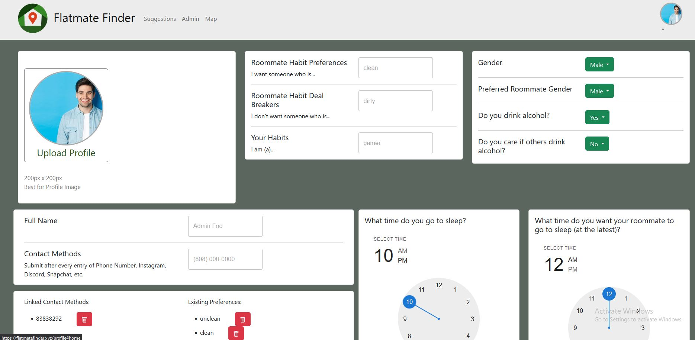
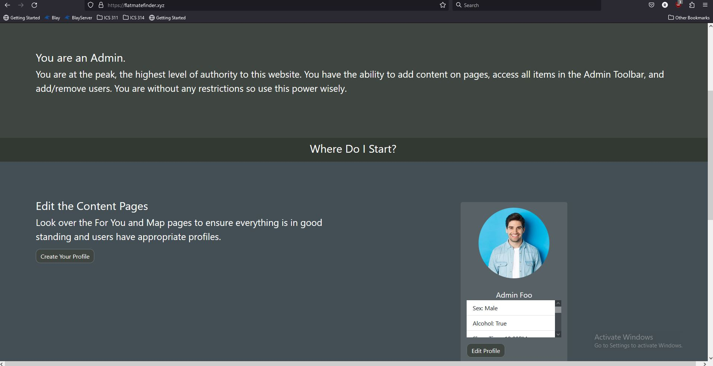

## The Project
Flatmate finder was a project inspired by a friend's pain, who had to deal with terrible roomates, not once, not twice, but three times. As such, I was determined to make something that at least looked decent. I'm not very good at making things look good, but I am confident in my ability to bring things together, and that's exactly what I did. I managed to bring the data that we took from forms, like this: 
 

 
into a database to ensure the data stayed forever, and then made sure that data that we took from the user could be used elsewhere on the website. I also ensured that the data we got from actual users on the eloyed website were upheld at all times, so that we wouldn't lose them whenever we had to add something new. I did a lot more things, but none of them were as important as the two mentioned above. That being said, my teamates did a lot of work on the website as well, and helped the website grow into much more than a simple class proposal. The website simply couldn't have shined without one of the main things I learned from this process.
### Teamwork makes the Dream Work
Any job is about knowing how to do the work, and when to do the work. All human beings burn out, at one point or another, they just won't be able to do as much work as they could at their peak, no one can be at peak efficiency 100% of the time. However, this is what a team is for. The diversification of work, if you will, is one of the best ways to keep the team at peak efficiency, and we did that fairly well. While there were times that I could have stepped back a bit, I sincerely feel that everyone on my team worked hard for the website, to make it look how it looks today
 

 
A big part of our teamwork was the organization of work in the first place, everyone had to know what to do, or at least what was left to do. This was what the issues were for, the work was devided semi-evenly into more than 50 issues, and each individual person would tackle a single issue.
### Where to find the website
The website itself can be found at our custom domain, https://flatmatefinder.xyz, and our source code can be found through our orginazitions github, https://github.com/flatmatefinder
