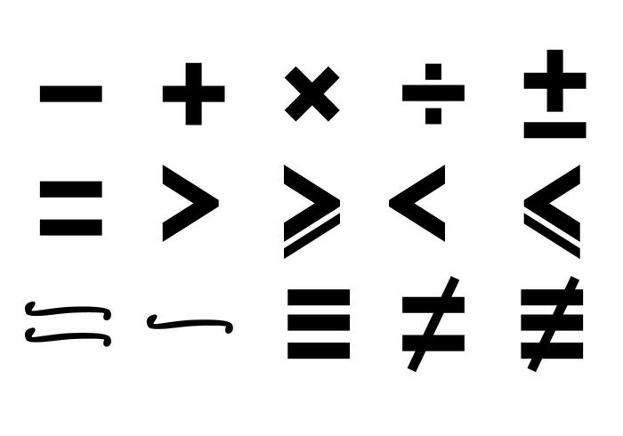

## Learning python
Learning python is something that I've been wanting to do for a very long time, I've had a little bit of experience with it, but never really delved too deep in it.
I'm planning on becoming a physicist, and in order to do that, I need to learn python. 
### Online Answers
So I looked online, I was looking for anyway I could hone my python skills, and then I saw these mini projects. I decided then and there that I would do one of them,
and that I would pack it full with as many extra things as I possibly could, which is how I came up with my version of the gtn game.
```
"""
Goals for guess the number (computer version):
1. Get user input to get the range of numbers.
2. get a random number in said range.
3. have the user guess a number within their own range.
4. compare the number they guessed with
   the number generated by the computer.
"""
import math
import random
import mysql.connector


def getnum():
    lower = input("What is the lower bound?")
    if not checkinput(lower):
        return getnum()
    lower = int(lower)
    upper = input("What is the upper bound?")
    if not checkinput(upper, lower=lower + 1):
        return getnum()
    upper = int(upper)
    global answer
    answer = random.randint(lower, upper)
    return [lower, upper]


def guessnum(lower: int, upper: int):
    guess = input("Make your guess!")
    if not checkinput(guess, lower, upper):
        guessnum(lower, upper)
        return
    guess = int(guess)
    bound = math.floor((upper - lower) / 10)
    if guess is answer:
        print("Exactly correct! +3 points!")
    elif answer - bound <= guess <= answer + bound:
        print("in the ballpark! +1 point!")
    else:
        print("Incorrect, try again!")


def checkinput(input: str, lower=None, upper=None):
    if not input.isdigit():
        print("Not a number, please try again.")
        return False
    intrep = int(input)
    if lower is None and upper is None:
        if not 0 <= intrep <= 1000000:
            print("not within bounds")
            return False
    elif lower is None:
        if not 0 <= intrep <= upper:
            print("not within bounds")
            return False
    elif upper is None:
        if not lower <= intrep <= 1000000:
            print("not within bounds")
            return False
    else:
        if not lower <= intrep <= upper:
            print("not within bounds")
            return False
    return True


def storedata(data):
    try:
        db = mysql.connector.connect(
            host="localhost",
            user="root",
            password="Hyp@ti@nino3",
            database="based_af"
        )
        dbcursor = db.cursor()
    except Exception as exception:
        db = mysql.connector.connect(
            host="localhost",
            user="root",
            password="Hyp@ti@nino3"
        )
        dbcursor = db.cursor()
        dbcursor.execute("CREATE DATABASE based_af")
        db._database = "based_af"

    dbcursor.execute("SHOW DATABASES")
    print("Databases:\n")
    for x in dbcursor:
        print(x)
    dbcursor.execute("SHOW TABLES")
    print("Tables:\n")
    for x in dbcursor:
        print(x)

    dbcursor.execute("INSERT INTO u_name_points (name, points) VALUES (Xavier, 50)")
    dbcursor.execute("SELECT * FROM u_name_points")

    my_result = dbcursor.fetchall()

    for x in my_result:
        print(x)
    db.commit()


while True:
    bounds = getnum()
    guessnum(bounds[0], bounds[1])
    storedata("yomamma")
```
This code, which uses SQL to store its data, uses every extra aspect that I could think of to speed up my apprehension of the python language, and even gives me a good introductory to SQL,
which is undoubtedly something I need. 
